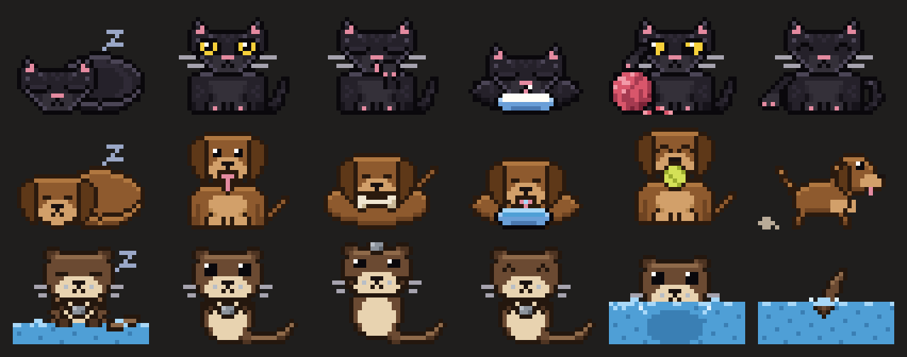

# pet

A little pixel art pet that lives in the band above the prompt in the Claude Code desktop app. It sleeps while Claude is idle, wakes up when Claude starts working, and moves between its activities, with animated transitions, until the turn ends.



## Pets

**Cat**: a black kitten with yellow eyes.

| Activity | What it does | How long |
| --- | --- | --- |
| `sleep` | Curled up in a bun, breathing, Z's drifting up | While Claude is idle |
| `sit` | Sits and stares at you, blinks, flicks its tail | 3 minutes |
| `groom` | Licks its paw and wipes its face | 3 minutes |
| `yarn` | Bats a ball of yarn around | 3 minutes |
| `milk` | Laps milk from a bowl | 10 seconds |
| `hunt` | Follows a fly with its eyes, pounces, catches it | Until the fly is caught |

**Dog**: a brown pup with floppy ears.

| Activity | What it does | How long |
| --- | --- | --- |
| `sleep` | Curled up, Z's drifting up | While Claude is idle |
| `look` | Looks at you panting, tongue out, tail wagging | 3 minutes |
| `bone` | Lies down chewing a bone | 3 minutes |
| `catch` | Catches a tennis ball in its mouth | Until it drops the ball |
| `zoomies` | Spins round in circles | 3 seconds |
| `water` | Drinks from a water bowl | 10 seconds |

**Otter**: a round brown otter that never lets go of its rock.

| Activity | What it does | How long |
| --- | --- | --- |
| `sleep` | Floats on its back holding its rock | While Claude is idle |
| `swim` | Jumps into its pond, swims back and forth, dives | 3 minutes |
| `rock` | Tosses its rock up and catches it | 3 minutes |

## Commands

| Command | What it does |
| --- | --- |
| `/pet cat`, `/pet dog`, `/pet otter` | Switch pets (remembered between sessions) |
| `/pet <activity>` | Jump to one of the current pet's activities, e.g. `/pet zoomies` |
| `/pet` | Switch to a random activity |
| `/pet hide`, `/pet show` | Hide or show the pet |
| `/pet layout wrap` | When other mods crowd the band, the pet moves to its own line (default) |
| `/pet layout shrink` | The pet keeps its spot and other band content is cut short |

## Requirements

- The Claude Code **desktop app**. The pet is drawn as an image, which the terminal can't show; in the terminal the mod stays out of the way.
- A Claude Code build with function-hook mods (`hooks/hooks.json` with `modules`).

## Install

In your shell:

```bash
claude plugin marketplace add gmorubio/claude-mods
claude plugin install pet@claude-mods
```

Or both at once from inside a Claude Code session:

```
/plugin install pet --marketplace gmorubio/claude-mods
```

Or load it from a local checkout for one session:

```
claude --plugin-dir /path/to/claude-mods/pet
```

## How it's built

- `hooks/pixels.ts`: the shared pixel engine (palette, shapes, SVG output, scenes and transitions).
- `hooks/cat.ts`, `hooks/dog.ts`, `hooks/otter.ts`: one file per pet, with its frames, activities and timings.
- `hooks/register.tsx`: the mod itself: the `/pet` command, the sleep/wake schedule and drawing the band.

To add a pet, write a new file that exports a `Species` and add it to `PETS` in `register.tsx`.
